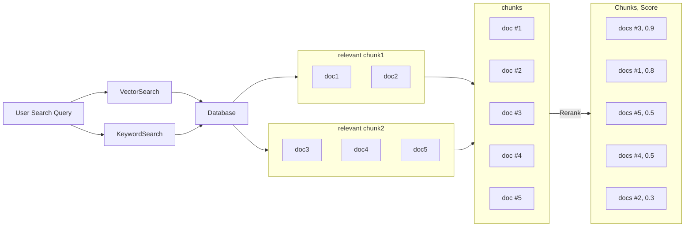

- Chunking policy
- leverage metadata
- Query Rewrite
- Hybird Search 
- Docunment Reranking

# Hybird Search +  Docunment Reranking

```mermaid
flowchart LR


searchQuery["User Search Query"] --> VectorSearch
searchQuery["User Search Query"] --> KeywordSearch


VectorSearch --> Database
KeywordSearch --> Database
Database --> relevantChunks1
Database --> relevantChunks2

subgraph relevantChunks1["relevant chunk1"]
    doc1
    doc2
end
subgraph relevantChunks2["relevant chunk2"]
    doc3
    doc4
    doc5
end
relevantChunks1 --> chunks
relevantChunks2 --> chunks

subgraph chunks
direction LR
chunk1["doc #1"]
chunk2["doc #2"]
chunk3["doc #3"]
chunk4["doc #4"]
chunk5["doc #5"]
end

chunks --> |Rerank| ChunkScore

subgraph ChunkScore["Chunks, Score"]
direction LR
rechunk1["docs #3, 0.9"]
rechunk2["docs #1, 0.8"]
rechunk3["docs #5, 0.5"]
rechunk4["docs #4, 0.5"]
rechunk5["docs #2, 0.3"]
end

```